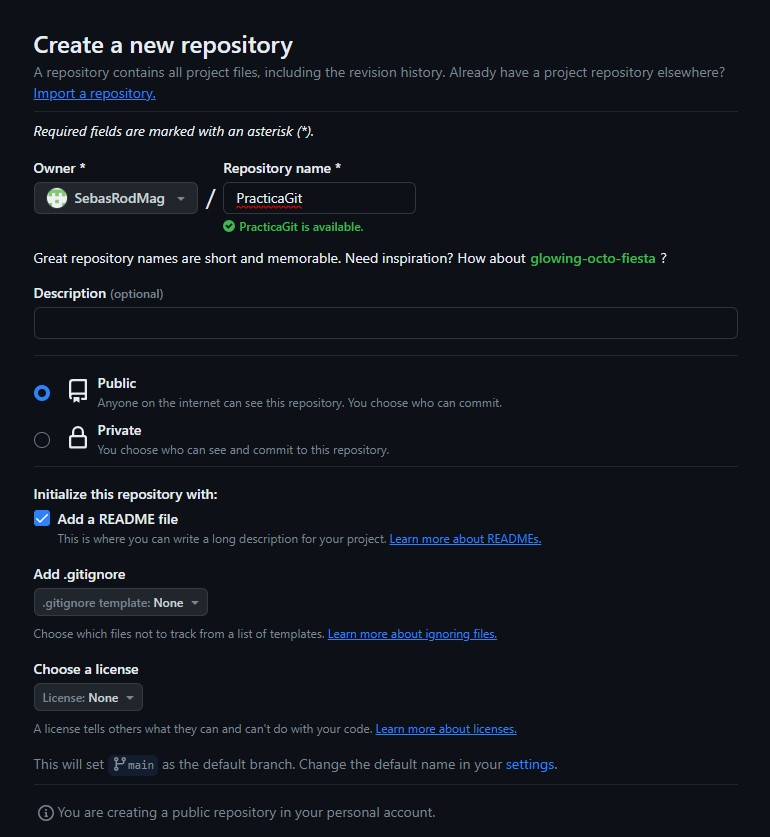
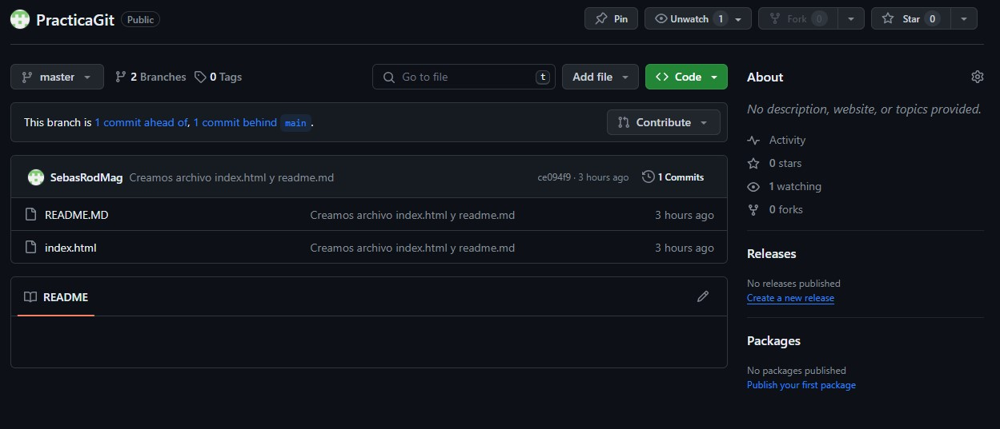
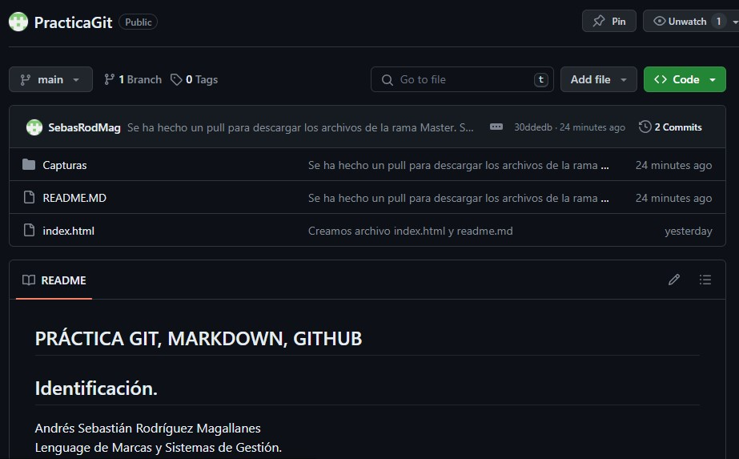
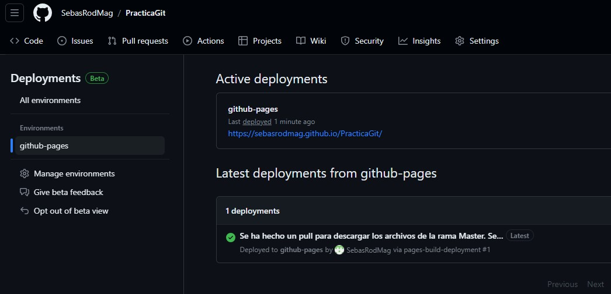
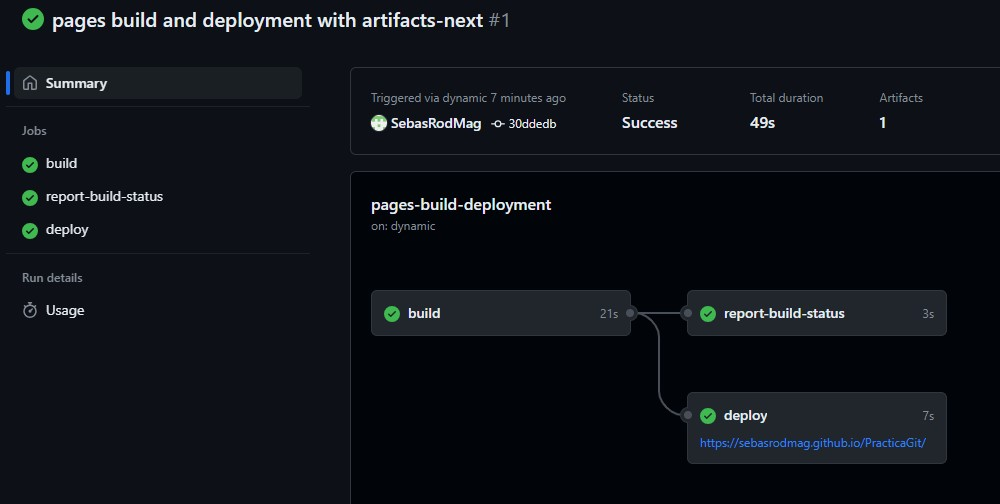
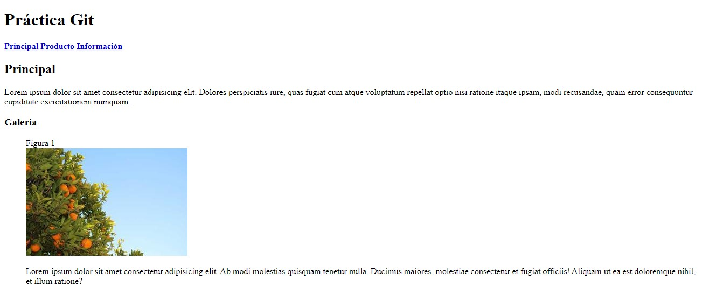
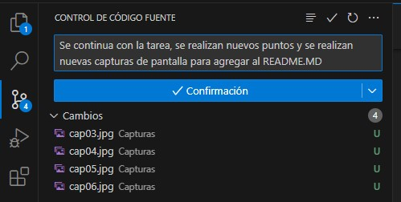
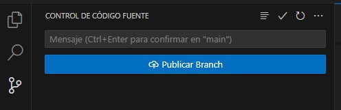
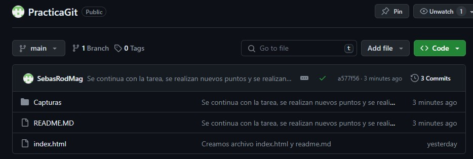
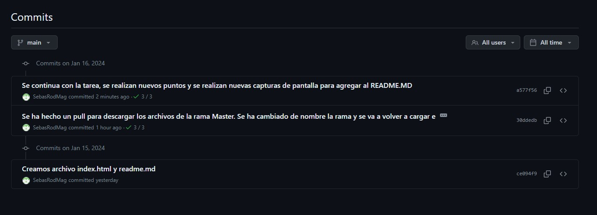

## PRÁCTICA GIT, MARKDOWN, GITHUB
## Identificación.
* Andrés Sebastián Rodríguez Magallanes\
* Lenguaje de Marcas y Sistemas de Gestión.\
* IES Aguadulce.\
* 1º Desarrollo de Aplicaciones Web.\
* Enlace a la web [Practica Git](https://sebasrodmag.github.io/PracticaGit/ "Link a la página")

## Uso de Git mediante la terminal git bash.
* Creación del repositorio en nuestro ordenador (_init_)

```
sebas@HP-Sebas MINGW64 /d/OneDrive/DAW/Lenguaje de Marcas/PracticaGit (master)
$ git init
Initialized empty Git repository in D:/OneDrive/DAW/Lenguaje de Marcas/PracticaGit/.git/
```
* Creación de un commit inicial (_add_, _status_, _commit_, _log_),
```
sebas@HP-Sebas MINGW64 /d/OneDrive/DAW/Lenguaje de Marcas/PracticaGit (master)
$ git add index.html README.MD
```
```
sebas@HP-Sebas MINGW64 /d/OneDrive/DAW/Lenguaje de Marcas/PracticaGit (master)
$ git commit -m "Creamos archivo index.html y readme.md "
[master (root-commit) ce094f9] Creamos archivo index.html y readme.md
 2 files changed, 61 insertions(+)
 create mode 100644 README.MD
 create mode 100644 index.html
```
```
sebas@HP-Sebas MINGW64 /d/OneDrive/DAW/Lenguaje de Marcas/PracticaGit (master)
$ git log
commit ce094f9f371654cbd033a05ef931d4eee8520cb4 (HEAD -> master)
Author: Sebastian <sebas517@hotmail.com>
Date:   Mon Jan 15 21:22:29 2024 +0100

    Creamos archivo index.html y readme.md
```
* Creación del repositorio en _Github_


* Añadir el remoto al repositorio local (_branch_, _remote_)

```
sebas@HP-Sebas MINGW64 /d/OneDrive/DAW/Lenguaje de Marcas/PracticaGit (master)
$ git branch
* master
```
```
sebas@HP-Sebas MINGW64 /d/OneDrive/DAW/Lenguaje de Marcas/PracticaGit (master)
$ git remote add origin https://github.com/SebasRodMag/PracticaGit.git
```
```
sebas@HP-Sebas MINGW64 /d/OneDrive/DAW/Lenguaje de Marcas/PracticaGit (master)
$ git remote -v
origin  https://github.com/SebasRodMag/PracticaGit.git (fetch)
origin  https://github.com/SebasRodMag/PracticaGit.git (push)
```
* Subir el repositorio a Github (_push_)

```
sebas@HP-Sebas MINGW64 /d/OneDrive/DAW/Lenguaje de Marcas/PracticaGit (master)
$ git push origin master
Enumerating objects: 4, done.
Counting objects: 100% (4/4), done.
Delta compression using up to 4 threads
Compressing objects: 100% (3/3), done.
Writing objects: 100% (4/4), 1016 bytes | 338.00 KiB/s, done.
Total 4 (delta 0), reused 0 (delta 0), pack-reused 0
remote: 
remote: Create a pull request for 'master' on GitHub by visiting:
remote:      https://github.com/SebasRodMag/PracticaGit/pull/new/master
remote:
To https://github.com/SebasRodMag/PracticaGit.git
 * [new branch]      master -> master
```
* Comprobar que está subido a Github.




## Cambiar el nombre a la rama Master.

Este cambio debería de haberse hecho en el primer momento que se crea el repositorio y se vincula a Git.\
**Para solucionarlo:**
* Con el parámetro _-m_ renombramos la rama
```
sebas@HP-Sebas MINGW64 /d/OneDrive/DAW/Lenguaje de Marcas/PracticaGit (master)
$ git branch -m main
```
* Actualizamos los _symbolic refs_ para usar la rama como main

```
sebas@HP-Sebas MINGW64 /d/OneDrive/DAW/Lenguaje de Marcas/PracticaGit (main)
$ git push -u origin main
To https://github.com/SebasRodMag/PracticaGit.git
 ! [rejected]        main -> main (fetch first)
error: failed to push some refs to 'https://github.com/SebasRodMag/PracticaGit.git'
hint: Updates were rejected because the remote contains work that you do not
hint: have locally. This is usually caused by another repository pushing to
hint: the same ref. If you want to integrate the remote changes, use
hint: 'git pull' before pushing again.
hint: See the 'Note about fast-forwards' in 'git push --help' for details.
```
* Por precaución, no nos permite cambiar el nombre de la rama en el repositorio, dado a que hay contenido en él.\
Hacemos un Pull para asegurar que el contenido del repositorio se corresponde con el que tenemos en local.

```
sebas@HP-Sebas MINGW64 /d/OneDrive/DAW/Lenguaje de Marcas/PracticaGit (main)
$ git pull origin master
From https://github.com/SebasRodMag/PracticaGit
 * branch            master     -> FETCH_HEAD
Already up to date.
```

* Ahora forzamos el cambio de nombre de la rama.

```
sebas@HP-Sebas MINGW64 /d/OneDrive/DAW/Lenguaje de Marcas/PracticaGit (main)
$ git push --force origin main
Enumerating objects: 10, done.
Counting objects: 100% (10/10), done.
Delta compression using up to 4 threads
Compressing objects: 100% (9/9), done.
Writing objects: 100% (10/10), 129.69 KiB | 5.40 MiB/s, done.
Total 10 (delta 0), reused 0 (delta 0), pack-reused 0
To https://github.com/SebasRodMag/PracticaGit.git
 + 021ed17...30ddedb main -> main (forced update)
```
* Comprobamos el contenido del repositorio en la nueva rama.



# Publicación en Github Pages:

## Configurar el repositorio para que publique el directorio raíz en Github Pages.

En GitHub Pages se permite la implementación desde la raíz de la rama main.



## Mostrar los despliegues (deployments).

Se muestran tanto el despliegue de la pagina web.



## Mostrar la página web.

Muestra de la página web con un codigo base.
Se puede visitar la página web [aquí.](https://sebasrodmag.github.io/PracticaGit/ "Link a la página")



## Uso de Git mediante la interfaz de VSCode:

### Creación de otro commit

Mediante la interfaz gráfica de Visual Studio, realizamos un nuevo commit para las nuevas modificaciones realizadas.



### Subir el repositorio a Github

Luego de realizar el commit, realizamos la publicación:



### Comprobar que está subido a Github

Verificamos en el repositorio de GitHub que todo se ha subido correctamente:


### Ver el listado de commit desde Github.

Vemos los commits realizados desde la página de GitHub:

